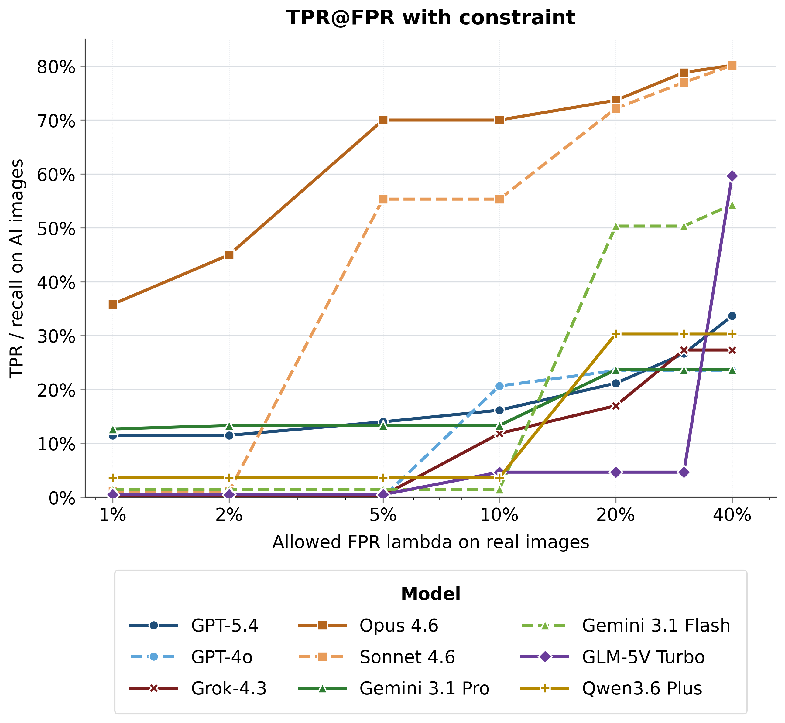
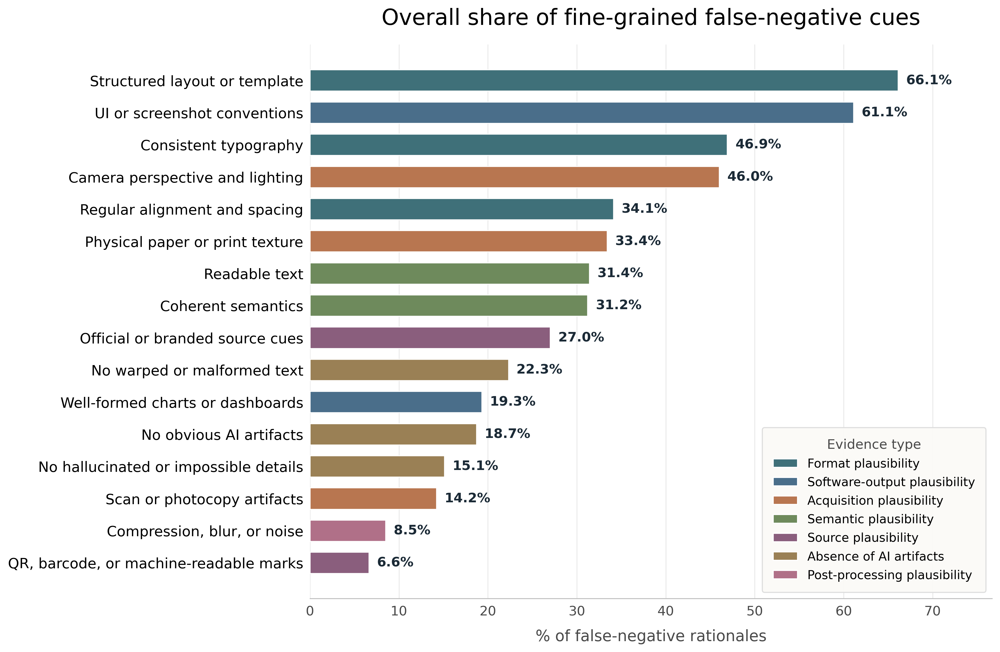

# SYNCRED-Bench

**Benchmarking Synthetic Credibility in AI-Generated Visual Misinformation**

[English](README.md) | [中文](README_zh.md)

[Paper](https://arxiv.org/pdf/2606.03348) · [Code](https://github.com/thu-coai/Syncred-Bench) · [Dataset](https://huggingface.co/datasets/thu-coai/Syncred-Bench)

The full image set is available at [Hugging Face](https://huggingface.co/datasets/thu-coai/Syncred-Bench).


SYNCRED-Bench studies **synthetic credibility**: AI-generated images that look trustworthy because they imitate authoritative visual forms and realistic circulation traces. Examples include fake notices, credentials, news layouts, platform screenshots, analytical displays, and assessment materials.

The benchmark contains 600 AI-generated misinformation images across six credible-form categories and seven circulation styles. It also introduces FP450, a real-image negative set for false-positive measurement. The paper reports that current detectors remain unreliable: under a 5% false-positive-rate constraint, 15 MLLM judges average 10.5% TPR, open-source AIGC detectors average below 5% TPR, commercial APIs reach 57.6%, and human majority voting reaches 63.0% TPR with 27.0% FPR.

## What Is Included

- A simple MLLM-as-judge evaluation script: `scripts/evaluate_mllm.py`
- Bash wrapper: `scripts/run_mllm.sh`
- Environment examples: `.env.example`, `api.txt.example`
- README figures derived from the paper experiments
- Documentation of the dataset taxonomy, evaluation protocol, and responsible-use notes

## Quick Start

Install dependencies:

```bash
pip install -r requirements.txt
```

Create an API config:

```bash
cp .env.example .env
# fill OPENAI_BASE_URL and OPENAI_API_KEY
```

Or create `api.txt`:

```text
url: https://your-openai-compatible-endpoint/v1
key: sk-your-key-here
```

Place the released images under an image folder such as `/path/to/SynCred_600`. The expected input is a flat folder whose filenames follow:

```text
SynCred_600/
  AD_CC_50.png
  ML_NR_0.png
  PI_OP_75.png
```

The script reads labels from the filename: `CONTENT_STYLE_INDEX.png`. For example, `AD_CC_50.png` is content `AD` / Analytical Display, style `CC` / Camera Copy, index `50`.

Run multiple MLLM judges:

```bash
python scripts/evaluate_mllm.py \
  --data-dir /path/to/SynCred_600 \
  --output-dir /path/to/results/mllm \
  --models gpt-4o-2024-11-20 qwen/qwen-vl-max
```

Bash wrapper example:

```bash
SYNCRED_DATA_DIR=/path/to/SynCred_600 \
SYNCRED_OUTPUT_DIR=/path/to/results/mllm \
bash scripts/run_mllm.sh --models gpt-4o-2024-11-20 qwen/qwen-vl-max
```

Evaluate a real negative set such as FP450:

```bash
python scripts/evaluate_mllm.py \
  --data-dir /path/to/FP450 \
  --output-dir /path/to/results/fp450_mllm \
  --model gpt-4o-2024-11-20 \
  --ground-truth real
```

Outputs:

- `<output-dir>/<model>.jsonl`: per-image predictions
- `<output-dir>/summary.csv`: overall, content, and style summaries
- `<output-dir>/manifest.json`: run metadata

The script resumes completed images by default. Add `--overwrite` to regenerate a result file.

## Dataset Taxonomy

Credible-form categories:

| Code | Category | Examples |
| --- | --- | --- |
| ML | Media Layout | news app pages, TV lower-thirds, newspaper pages |
| IN | Institutional Notice | official notices, public announcements |
| PI | Platform Interface | social media pages, chat windows, webpages |
| CR | Credential Record | certificates, awards, invoices, receipts, order pages |
| AD | Analytical Display | charts, dashboards, ranking reports, backend panels |
| AM | Assessment Material | exam papers, admission tickets, transcripts, admission notices |

Credible-circulation styles:

| Code | Style | Cue |
| --- | --- | --- |
| NR | Native Rendering | clean direct render or screenshot |
| SC | Scanned Copy | page borders, shadows, slight skew, scanner noise |
| CC | Camera Copy | paper curvature, uneven lighting, background context |
| FC | Fax Copy | banding, blur, fax or photocopy artifacts |
| SP | Screen Photograph | moire, glare, reflections, screen bezels |
| CV | Cropped View | missing margins and truncated context |
| OP | Online Compression | recompression, pixelation, reduced sharpness |

## Evaluation Notes

The MLLM prompt asks the model to decide whether the image is AI-generated and to return compact JSON:

```json
{"ai_generated":true,"confidence":0.73,"reason":"brief visual evidence"}
```

For SYNCRED-Bench positives, `ground_truth=ai`. For real negative sets, use `--ground-truth real`. The summary reports `ai_rate` and accuracy for each model, content category, and circulation style.





## Citation

```bibtex
@misc{yang2026syncredbench,
  title = {SYNCRED-BENCH: Benchmarking Synthetic Credibility in AI-Generated Visual Misinformation},
  author = {Yang, Junxiao and Zhang, Minghao and Wang, Xiaoce and Liu, Haoran and Cui, Shiyao and Wang, Hongning and Huang, Minlie},
  year = {2026},
  eprint = {2606.03348},
  archivePrefix = {arXiv},
  primaryClass = {cs.CV}
}
```

## Responsible Use

SYNCRED-Bench is intended for research on synthetic-image detection, provenance reasoning, and visual misinformation safety. Do not use the data, prompts, or examples to deceive people, impersonate institutions, manipulate political processes, or misuse credibility-bearing synthetic images outside legitimate research and safety evaluation.
